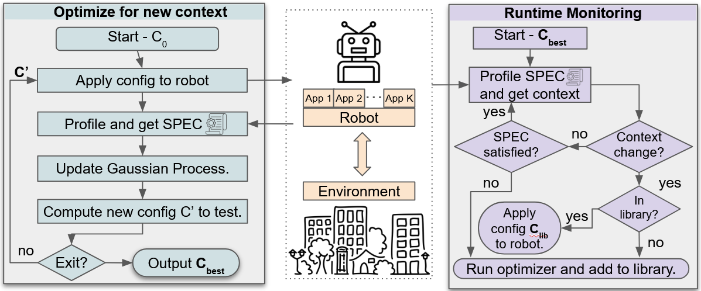

# ConfigBot: Adaptive Resource Allocation for Robot Applications in Dynamic Environments



This repository contains code to identify near-optimal resource configurations for robot stacks using ROS1. To use our approach you will have to:

1. Pull our custom ROS image [from DockerHub](https://hub.docker.com/r/rohitdwivedula/ros/tags)- or build it from from source [using this repo](https://github.com/ldos-project/configbot_ros_comm/). Use these commands to pull, run and enter the container:

```bash
docker pull rohitdwivedula/ros:noetic-adaptor
git clone https://github.com/ldos-project/configbot
cd configbot
docker run -d --network host -v $PWD:/root/configbot --cgroupns host --name ros-container rohitdwivedula/ros:noetic-adaptor sleep infinity
docker exec -it ros-container /bin/bash
```

2. You will have to install your ROS apps inside this container and populate `optim/optim_params.py`. This file contains information on your ROS nodes - what is your objective, what are your constraints, which topics and nodes is the optimization algorithm allowed to tune?
3. Run `python3 iterate.py` to run the optimization. All the configurations identified are saved to a JSON file.  
4. Run `python3 apply_config.py` to use the best performing config.
5. Use `python3 monitor.py` to monitor for constraint violations after you have applied the best performing configuration. 
6. We performed this process for multiple stacks and multiple robots, the results of which are available in our paper.

## End-to-end demonstration
To illustrate the workflow, we have created a `dummy_stack` of five ROS nodes that you can use to run the entire workflow. Note that this is **not** actual application code; this is merely to demonstrate how you would use the workflows in this repository for your real apps. See `dummy_stack/README.md` for more information.

# Reference
If you find this repository useful in your work, consider citing:

```
@article{dwivedula2025configbot,
  title={ConfigBot: Adaptive Resource Allocation for Robot Applications in Dynamic Environments},
  author={Dwivedula, Rohit and Modak, Sadanand and Akella, Aditya and Biswas, Joydeep and Kim, Daehyeok and Rossbach, Christopher J},
  journal={arXiv preprint arXiv:2501.10513},
  year={2025}
}
```